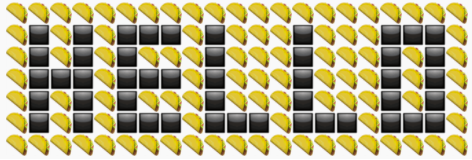

# Slacktalker

## Usage

### Example
    node app say hello -p :taco: -s :black_large_square:

#### Output

    :taco::taco::taco::taco::taco::taco::taco::taco::taco::taco::taco::taco::taco::taco::taco::taco::taco::taco::taco::taco::taco:
    :taco::black_large_square::taco::black_large_square::taco::black_large_square::black_large_square::black_large_square::taco::black_large_square::taco::taco::taco::black_large_square::taco::taco::taco::black_large_square::black_large_square::black_large_square::taco:
    :taco::black_large_square::taco::black_large_square::taco::black_large_square::taco::taco::taco::black_large_square::taco::taco::taco::black_large_square::taco::taco::taco::black_large_square::taco::black_large_square::taco:
    :taco::black_large_square::black_large_square::black_large_square::taco::black_large_square::black_large_square::black_large_square::taco::black_large_square::taco::taco::taco::black_large_square::taco::taco::taco::black_large_square::taco::black_large_square::taco:
    :taco::black_large_square::taco::black_large_square::taco::black_large_square::taco::taco::taco::black_large_square::taco::taco::taco::black_large_square::taco::taco::taco::black_large_square::taco::black_large_square::taco:
    :taco::black_large_square::taco::black_large_square::taco::black_large_square::black_large_square::black_large_square::taco::black_large_square::black_large_square::black_large_square::taco::black_large_square::black_large_square::black_large_square::taco::black_large_square::black_large_square::black_large_square::taco:
    :taco::taco::taco::taco::taco::taco::taco::taco::taco::taco::taco::taco::taco::taco::taco::taco::taco::taco::taco::taco::taco:

...Now paste that into Slack
#### Result

